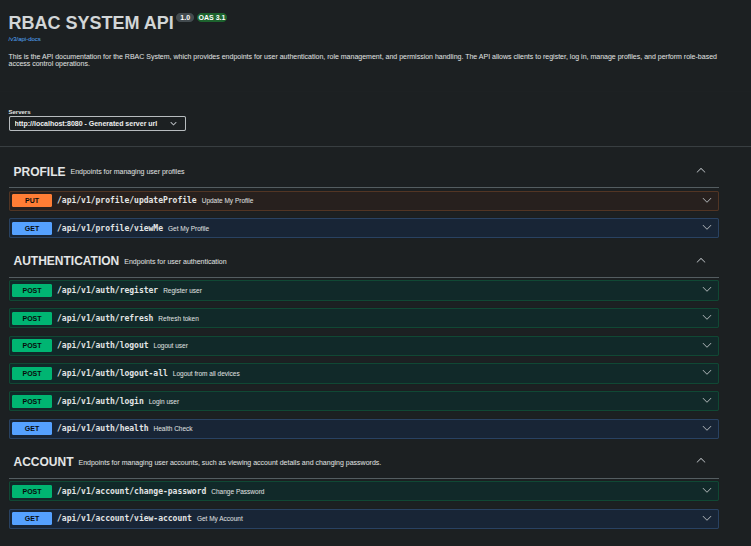
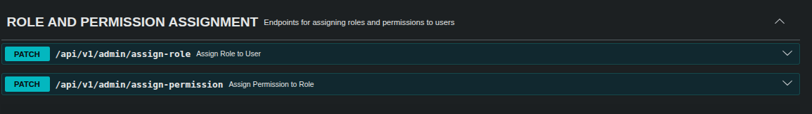
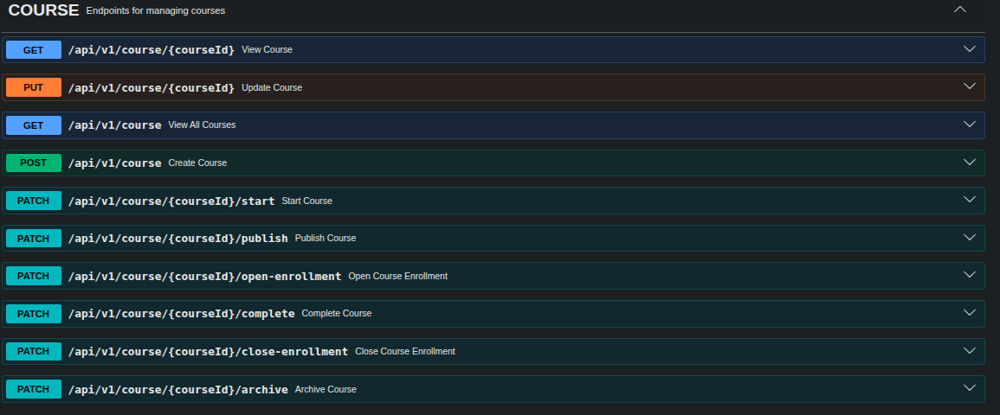

Auth System API

This is an authentication and authorization system built with Java/Spring Boot, implementing JWT-based authentication, Role-Based Access Control (RBAC). It includes comprehensive unit and integration tests.
****

Features

JWT Authentication – Secure login and token-based authentication.

Role-Based Access Control (RBAC) – Assign roles to users and define permissions.

Profile Management – Endpoints for creating, updating, and viewing user profiles.

Testing – Fully tested with unit and integration tests for critical endpoints.

****

***
## Authorization & Course Module Update

- Added course management endpoints
- Added role assignment to users
- Added permission assignment to roles
- Enforced RBAC using `@PreAuthorize`

### Highlights

- Secure course lifecycle management
- Centralized exception handling
- Duplicate role/permission validation
- Admin-only assignment control

Screenshots demonstrating the endpoints are included below.

### ROLE AND PERMISSION ASSIGNMENT

### COURSE MANAGEMENT

